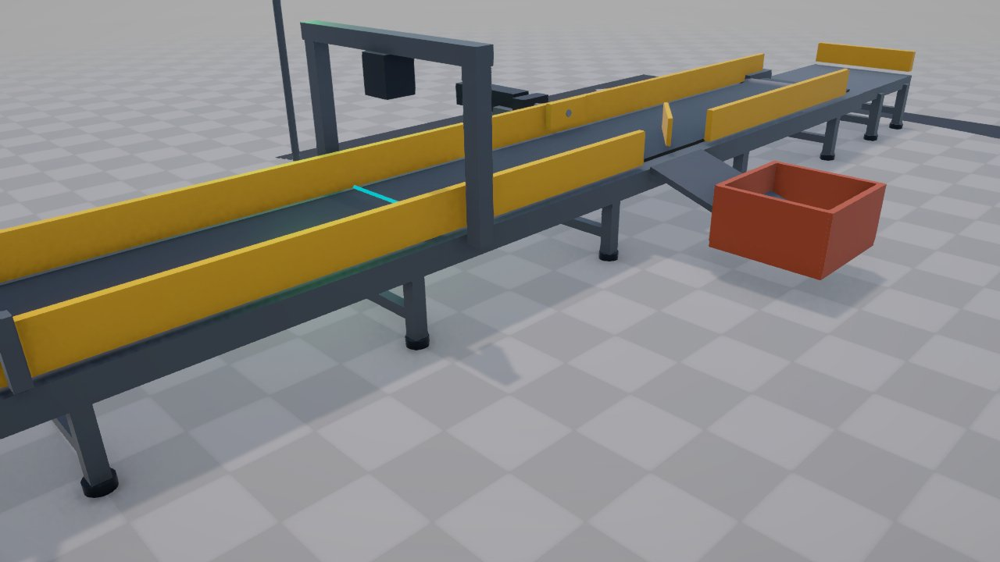
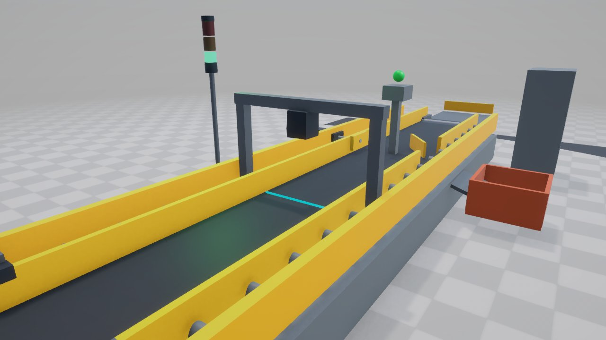

# Automated Conveyor & Sorting Cell Digital Twin (Unity 6 / Pure C#)

[](https://unity.com/)
[](LICENSE)
[](https://learn.microsoft.com/en-us/dotnet/csharp/)
[]()

An industrial digital twin project built in **Unity 6** with **pure C# simulation logic**. It simulates a fully automated factory quality-control and sorting station with real-time physics, optical inspection, pneumatic actuation, and an interactive SCADA HUD dashboard.

---

## 📸 Simulation Showcase


*Figure 1: Full Automated Sorting Cell in nominal production with live SCADA HUD, Pass Accumulation, Diverter Chute, and 3-Tier Andon Light.*


*Figure 2: Cognex/Keyence-style Machine Vision scanner with projected cyan laser sheet and optical photo-eye sensor.*

---

## 🏗️ Digital Twin Architecture

The simulation runs entirely within Unity's native physics and C# runtime with zero external dependencies:

```
+-------------------------------------------------------------------------+
|                       Automated Sorting Cell Twin                       |
|                          (C# Simulation Loop)                           |
+------------------------------------+------------------------------------+
                                     |
    +--------------------------------+--------------------------------+
    |                                |                                |
    v                                v                                v
[ Conveyor Transport ]      [ Machine Vision Gate ]       [ Pneumatic Actuator ]
 - Continuous Belt Drive     - Optical Photo-Eye Sensor    - Parametric Stroke
 - Rigid Extruded Frame      - Cyan Laser Sheet Beam       - Real-time Actuation
 - Safety Guide Rails        - Surface & Dimension Check   - Rubber Contact Bumper
    |                                |                                |
    +--------------------------------+--------------------------------+
                                     |
                                     v
                       +---------------------------+
                       |   Dual Routing System     |
                       |  - Pass Accumulation      |
                       |  - 45° Reject Chute & Bin |
                       +-------------+-------------+
                                     |
                                     v
                       +---------------------------+
                       | Monitoring & SCADA HUD    |
                       |  - 3-Tier Andon Tower     |
                       |  - Live Diagnostics HUD   |
                       |  - Interactive Inspector  |
                       +---------------------------+
```

---

## ⚙️ Physical Cell Features

1. **Infeed & Transport Conveyor**:
   - Aluminum extruded framing with adjustable leveling pads.
   - High-friction transport belt with driven end drum rollers.
   - Dual safety-yellow guide rails with sorting cutouts.
   - 3-Phase electric motor drive unit.

2. **Machine Vision Inspection Gantry (X = -0.6m)**:
   - Overhead archway bridge structure.
   - High-speed industrial vision camera with integrated LED ring illuminator.
   - Dynamic cyan laser scanning sheet plane across the transport path.
   - Retro-reflective photoelectric sensor gate.

3. **Pneumatic Sorting Actuator Station (X = +1.8m)**:
   - Industrial pneumatic cylinder barrel with chrome piston rod.
   - High-visibility polymer pusher head with rubber dampener bumper.
   - Parametric stroke actuation with realistic extension curves and rapid spring-assisted return.

4. **Reject Divert Chute & Scrap Tote (Z = -1.8m)**:
   - 45-degree mechanical diverter guide fence.
   - Low-friction gravity sheet chute feeding into a heavy-duty industrial scrap tote bin.

5. **3-Tier Industrial Andon Stack Light**:
   - 🔴 **Red**: Emergency Stop / Line Halted
   - 🟡 **Amber**: Defect detected / Pneumatic actuator actively diverting
   - 🟢 **Green**: Nominal automated production

6. **Interactive SCADA HUD Dashboard**:
   - Real-time line speed, throughput (parts/min), pass count, reject count, and defect percentage.
   - Live I/O indicators (Vision Sensor, Pusher State, Andon State).
   - Clickable camera view buttons (Overview, Vision Inspection, Pneumatic Pusher, Reject Chute).
   - Interactive workpiece inspector displaying real-time dimensions, quality status, and timestamps.

---

## 💻 Pure C# Control API

All digital twin operations are exposed through clean, static C# methods on `AutomatedSortingCellTwin`:

```csharp
// Read live operational telemetry
string json = AutomatedSortingCellTwin.CellGetTelemetry();

// Adjust conveyor transport speed (0.4 to 4.0 m/s)
AutomatedSortingCellTwin.CellSetSpeed(2.2f);

// Inject intentional defects for quality validation ("Dimension" or "Surface Flaw")
AutomatedSortingCellTwin.CellInjectDefect("Dimension");

// Manually trigger the pneumatic pusher
AutomatedSortingCellTwin.CellTriggerPusher();

// Engage or disengage Emergency Stop
AutomatedSortingCellTwin.CellToggleEmergencyStop(true);

// Reset throughput and defect statistics
AutomatedSortingCellTwin.CellResetStats();

// Switch camera view presets ("overview", "vision", "pusher", "chute")
AutomatedSortingCellTwin.CellSetCamera("vision");

// Spawn custom workpieces dynamically
AutomatedSortingCellTwin.CellSpawnWorkpiece(isDefective: true, defectType: "Scratch");
```

---

## 🚀 Getting Started

### Prerequisites
- **Unity 6** (`6000.0` or higher, e.g. `6000.3.25f1`) with Universal Render Pipeline (URP).
- No external packages or plugins required!

### 1. Clone the Repository
```bash
git clone https://github.com/<your-username>/DigitalTwinUnity.git
cd DigitalTwinUnity
```

### 2. Open in Unity
1. Launch **Unity Hub**.
2. Click **Add** -> **Add project from disk** and select the cloned `DigitalTwinUnity` folder.
3. Open the project with Unity 6.
4. Open the scene at `Assets/Scenes/ConveyTwin_Main.unity`.
5. Press **Play** ▶️ to run the simulation!

---

## 📁 Repository Structure

```
DigitalTwinUnity/
├── Assets/
│   ├── Scenes/
│   │   └── ConveyTwin_Main.unity           # Configured digital twin scene
│   └── Scripts/
│       ├── AutomatedSortingCellTwin.cs     # Core digital twin simulation logic & C# API
│       ├── SortingCell.asmdef              # Isolated assembly definition
│       └── Editor/
│           ├── AutomatedSortingCellEditor.cs # Menu item for one-click scene setup
│           └── SortingCell.Editor.asmdef
├── Packages/
│   ├── manifest.json                       # Core Unity packages (URP, Input System, UI)
│   └── packages-lock.json
├── ProjectSettings/                        # Unity physics, tag, and project configurations
├── docs/
│   └── images/                             # Showcase screenshots
├── .gitignore                              # Clean Unity gitignore configuration
├── LICENSE                                 # MIT License
└── README.md                               # Project documentation
```

---

## 📄 License
This project is licensed under the [MIT License](LICENSE).
