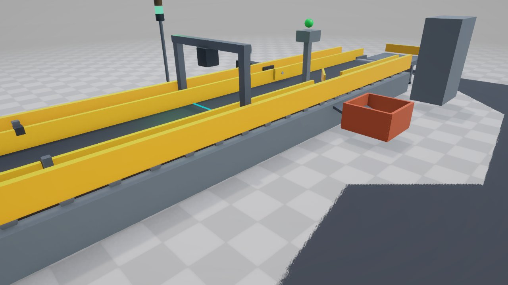

# Automated Conveyor & Sorting Cell Digital Twin (Unity 6 / Pure C#)

[](https://unity.com/)
[](LICENSE)
[](https://learn.microsoft.com/en-us/dotnet/csharp/)
[]()

A standalone industrial digital twin simulation built in **Unity 6** with **pure C# logic**. It models an automated factory quality-control and sorting line featuring kinematic conveyor transport, optical machine vision inspection with a projected laser sheet, parametric pneumatic pusher actuation, automated jam detection with safe recovery, and a real-time SCADA HUD dashboard.

---

## 📸 Simulation Showcase


*Figure 1: Full Automated Sorting Cell in nominal production with live SCADA HUD, Pass Accumulation Table, Diverter Chute, and 3-Tier Andon Stack Light.*


*Figure 2: Overhead Machine Vision gantry with projected cyan laser scanning sheet and photoelectric retro-reflective sensor gate.*


*Figure 3: Pneumatic actuator firing to divert a defective workpiece down the 45° slide chute into the industrial scrap tote bin.*

---

## 🏗️ Digital Twin Architecture

The simulation runs natively within Unity with **zero external packages or Python dependencies**:

```
+-------------------------------------------------------------------------+
|                       Automated Sorting Cell Twin                       |
|                          (C# Simulation Loop)                           |
+------------------------------------+------------------------------------+
                                     |
    +--------------------------------+--------------------------------+
    |                                |                                |
    v                                v                                v
[ Kinematic Conveyor ]      [ Machine Vision Gate ]       [ Pneumatic Actuator ]
 - Continuous Belt Advance   - Optical Photo-Eye Sensor    - Parametric Stroke
 - Rigid Extruded Frame      - Cyan Laser Sheet Beam       - Real-time Actuation
 - Safety Guide Rails        - Surface & Dimension Check   - Rubber Contact Bumper
    |                                |                                |
    +--------------------------------+--------------------------------+
                                     |
                                     v
                       +---------------------------+
                       |   Dual Routing System     |
                       |  - Pass Accumulation      |
                       |  - 45° Reject Chute & Bin |
                       +-------------+-------------+
                                     |
                                     v
                       +---------------------------+
                       | Fault & Safety System     |
                       |  - Jam / Stall Detection  |
                       |  - Optical Bypass Check   |
                       |  - Emergency Stop         |
                       |  - 3-Tier Andon Stack     |
                       |  - Interactive SCADA HUD  |
                       +---------------------------+
```

---

## ⚙️ Physical Cell Features

1. **Infeed & Transport Conveyor**:
   - Aluminum extruded framing with adjustable leveling pads.
   - High-friction transport belt with driven end drum rollers.
   - Dual safety-yellow guide rails with sorting cutouts.
   - Scripted kinematic transport advance with dynamic speed control (0.4 to 4.0 m/s).

2. **Machine Vision Inspection Station (X = -0.6m)**:
   - Overhead archway bridge structure.
   - Industrial vision camera with integrated LED ring illuminator.
   - Dynamic cyan laser scanning sheet plane across the transport path.
   - Retro-reflective photoelectric sensor gate.

3. **Pneumatic Sorting Actuator Station (X = +1.8m)**:
   - Industrial pneumatic cylinder barrel with chrome piston rod.
   - High-visibility polymer pusher head with rubber dampener bumper.
   - Parametric stroke actuation with smooth extension curves and rapid spring-assisted return.

4. **Reject Divert Chute & Scrap Tote (Z = -1.8m)**:
   - 45-degree mechanical diverter guide fence.
   - Low-friction gravity sheet chute feeding into a heavy-duty industrial scrap tote bin.

5. **3-Tier Industrial Andon Stack Light**:
   - 🔴 **Red (Blinking on Jam / Solid on E-Stop)**: Line fault or emergency stop engaged.
   - 🟡 **Amber**: Defect detected / Pneumatic actuator actively diverting / Line paused.
   - 🟢 **Green**: Nominal automated production.

6. **Interactive SCADA HUD Dashboard**:
   - Real-time line speed, throughput (parts/min), pass count, reject count, and defect percentage.
   - Live I/O indicators (Vision Sensor, Pusher Proximity, Line Fault Status).
   - Clickable camera view buttons (Orbit, Vision Inspection, Pneumatic Pusher, Reject Chute).
   - Interactive workpiece inspector displaying real-time dimensions, quality status, and serial IDs.

---

## 🔍 Quality Inspection & Defect Types

The vision system evaluates each workpiece as it crosses the scanning gate:

* **Dimension Out-of-Spec (Over-Height / Over-Width)**: Workpiece height scales up to 0.35m (+59% over nominal 0.22m) and profile width scales to 0.48m. The scanner detects out-of-tolerance bounds.
* **Surface Flaw (Scratch / Dent)**: Detected via visual surface inspection.
* **Surface Contamination**: Irregular blemish detection.

When any defect is flagged, the workpiece receives a visual reject tint, and the pneumatic pusher strokes out at $X = +1.8\text{m}$ to divert it into the scrap chute.

---

## 🚨 Jam Detection & Recovery

The simulation includes automated fault interlocks:

1. **Conveyor Stall Fault**: If the conveyor is running but a workpiece fails to advance for $> 2.0\text{s}$, the system halts immediately.
2. **Scan Bypass Fault**: If an uninspected workpiece passes beyond the inspection zone without being scanned ($X > -0.05\text{m}$), the line trips a safety interlock.
3. **Alarm Behavior**: When a fault occurs, the conveyor stops, the status banner flashes `JAM FAULT`, and the Andon light flashes **RED**.
4. **Recovery**: Operators can click **`CLEAR JAM`** on the HUD or press **`C`** on the keyboard to remove the jammed part and restore the line to a safe, ready state.

---

## 🔄 Cell Reset System

The HUD provides two distinct reset operations:

* **`RESET CELL (CLEAR ALL)`** (or press **`R`**): Clears all in-flight and scrap workpieces, clears selected workpiece, resets all counters to zero, homes the pneumatic actuator, clears active jam/fault states, and resumes the line in nominal green production.
* **`RESET STATS ONLY`**: Clears throughput, pass, and reject counters while keeping workpieces in place on the line.

---

## ⌨️ Operator Controls & Hotkeys

| Input | Action |
|---|---|
| `Space` | Toggle Line Run / Pause (or clear jam if faulted) |
| `E` | Toggle Emergency Stop |
| `C` | Clear Jam & Recover Line |
| `R` | Reset Cell (Clear workpieces, home actuator, reset stats) |
| `J` | Test-inject simulated stall fault |
| `Right Mouse Drag` | Orbit camera around inspection cell |
| `Mouse Scroll` | Zoom camera in / out |
| `Left Click Part` | Inspect workpiece digital pedigree on HUD |

---

## 💻 Pure C# Control API

All digital twin operations are accessible programmatically via static methods on `AutomatedSortingCellTwin`:

```csharp
// Read live operational telemetry (JSON)
string json = AutomatedSortingCellTwin.CellGetTelemetry();

// Adjust conveyor transport speed (0.4 to 4.0 m/s)
AutomatedSortingCellTwin.CellSetSpeed(2.2f);

// Inject intentional defects ("Dimension (Over-Height)", "Surface Flaw", etc.)
AutomatedSortingCellTwin.CellInjectDefect("Dimension (Over-Height)");

// Manually trigger the pneumatic pusher
AutomatedSortingCellTwin.CellTriggerPusher();

// Clear active jam fault and resume line
AutomatedSortingCellTwin.CellClearJam();

// Full cell reset: clear workpieces, home actuator, reset counters
AutomatedSortingCellTwin.CellResetCell();

// Counters-only reset
AutomatedSortingCellTwin.CellResetStats();

// Engage or disengage Emergency Stop
AutomatedSortingCellTwin.CellToggleEmergencyStop(true);

// Switch camera presets ("overview", "vision", "pusher", "chute")
AutomatedSortingCellTwin.CellSetCamera("vision");

// Spawn custom workpieces dynamically
AutomatedSortingCellTwin.CellSpawnWorkpiece(defective: true, defectType: "Dimension");
```

---

## 🚀 Getting Started

### Prerequisites
* **Unity 6** (`6000.0` or higher, e.g. `6000.3.25f1`) with Universal Render Pipeline (URP).
* No external packages, plugins, or Python installation needed.

### 1. Clone the Repository
```bash
git clone https://github.com/<your-username>/DigitalTwinUnity.git
cd DigitalTwinUnity
```

### 2. Open in Unity
1. Launch **Unity Hub**.
2. Click **Add** ➔ **Add project from disk** and select the cloned `DigitalTwinUnity` folder.
3. Open the project with Unity 6.
4. The main simulation scene at `Assets/Scenes/ConveyTwin_Main.unity` is configured as the default active scene in `EditorBuildSettings.asset`.
5. Press **Play** ▶️ to run the simulation!

---

## 📁 Repository Structure

```
DigitalTwinUnity/
├── Assets/
│   ├── Scenes/
│   │   ├── ConveyTwin_Main.unity           # Primary digital twin simulation scene (Enabled)
│   │   └── SampleScene.unity               # Default fallback scene (Disabled)
│   ├── Scripts/
│   │   ├── AutomatedSortingCellTwin.cs     # Core digital twin simulation logic & C# API
│   │   ├── SortingCell.asmdef              # Isolated assembly definition (UnityEngine.UI)
│   │   └── Editor/
│   │       ├── AutomatedSortingCellEditor.cs # Editor menu item: 'Digital Twin > Setup...'
│   │       └── SortingCell.Editor.asmdef   # Editor assembly definition
│   └── Settings/                           # URP pipeline profiles & render assets
├── Packages/
│   ├── manifest.json                       # Core Unity packages (URP, Input System, UI)
│   └── packages-lock.json
├── ProjectSettings/
│   ├── EditorBuildSettings.asset           # Scene build order (ConveyTwin_Main at index 0)
│   ├── ProjectVersion.txt                  # Unity version specification (6000.3.25f1)
│   └── ...                                 # Project physics, tags, and quality settings
├── docs/
│   └── images/
│       ├── overview.jpg                    # Full cell overview screenshot
│       ├── vision.jpg                      # Machine vision scanner close-up
│       └── sorting_action.jpg              # Defective part sorting in action
├── .gitignore                              # Clean Unity gitignore configuration
├── LICENSE                                 # MIT License
└── README.md                               # Project documentation
```

---

## 📄 License
This project is open-source and licensed under the [MIT License](LICENSE).
